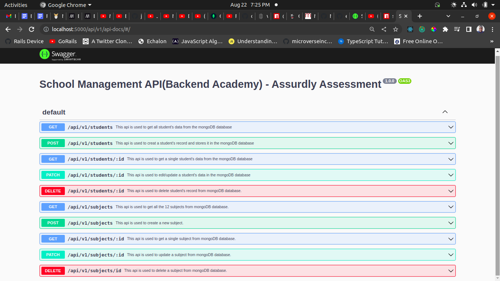

<h1 align="center">School Management System API(Backend Academy) for Assurdly Assessment</h1>
<p>
  
  <a href="https://github.com/charlyeneh/Backend-Academy-api/tree/app_development#readme" target="_blank">
    
  </a>
  <a href="https://github.com/charlyeneh/Backend-Academy-api/commit-activity" target="_blank">
    
  </a>
</p>

<br>

This is a simple REST service for the management of students at Backend Academy school. It was built with NodeJS, ExpressJS, mongoose and mongoDB. User can CRUD student's data(Bio data and subjects detail) as well as query simple statistical data relating to students in the school..



_The API documentation above can be accessed by visiting http://{host}:{PORT}/{API_PREFIX}/docs_

Example: http://localhost:5000/api/v1/api-docs/#/

## Documentation

- [Swagger](https://polar-garden-38142.herokuapp.com/api/v1/api-docs/)
- [Postman](https://documenter.getpostman.com/view/16835309/VUqpvJpt)

## Table of Contents

1. <a href="#tech-stack-used">Tech Stack Used</a>
2. <a href="#application-features">Application Features</a>
3. <a href="#how-to-use">How To Use</a>
4. <a href="#author">Author</a>
5. <a href="#license">License</a>

## Tech Stack Used

- [Node.js](https://nodejs.org/)
- [Express](https://expressjs.com/)
- [Mongoose](https://mongoosejs.com/docs/)
- [MongoDB](https://www.mongodb.com/what-is-mongodb)
- [Eslint](https://eslint.org/)
- [Swagger](https://swagger.io/)
- [Faker-js/faker](https://www.npmjs.com/package/@faker-js/faker)
- [Joi](https://www.npmjs.com/package/joi)

## Application Features

A user can

- add a student
- view a student
- view all students
- update a student
- delete a student
- view all students in a class
- view all students in a class that offer a particular subject
- view all (male/female)students in a class that offer a particular subject
- view all subjects
- add a subject for a student
- update a subject for a student
- delete a subject for a student

## How to Use

> Install [MongoDB](https://www.mongodb.com/what-is-mongodb)

> Clone the repository to your local machine

```sh
$ git clone https://github.com/charlyeneh/Backend-Academy-api.git
```

> Navigate into the project directory

```sh
$ cd inventory-management-system-api
```

> Set up environment variables

```sh
$ cp env.sample.env
# [NOTE]: Make sure to provide the necessary environment variables inside the .env file
```

> Fill in the environment variables. NB: `'NODE_ENV', 'PORT', 'API_PREFIX'` are _REQUIRED_

> Install the dependencies

```sh
$ npm install
```

> Run the seed.js file to generate mock data of the student's records

```sh
$ node seed.js
```

> Start the server. _Make sure your mongoDB deamon and redis client are running_

```sh
$ npm start
```

> Then open your browser and visit `http://127.0.0.1:3000/api/v1/status`. You should see `{"status":"OK"}`. You can also use postman to issue the `GET` request to the status endpoint.

> You can access the API documentation by visiting `http://127.0.0.1:3000/api/v1/docs`

NB: 3000 is the default port when you don't supply a port in the .env; 127.0.0.1 is the default host as well.

## Author

👤 **CHARLES CHUKWUNWEIKE ENEH**

- Github: [@charlyeneh](https://github.com/charlyeneh)
- Linkedin: [Charles Chukwunweike Eneh](https://www.linkedin.com/in/charles-chukwunweike-eneh/)

## 🤝 Contributing

Contributions, issues and feature requests are welcome!<br />Feel free to check [issues page](https://github.com/charlyeneh/Backend-Academy-api/issues).

1. Fork it (https://github.com/charlyeneh/Backend-Academy-api/fork)
2. Create your working branch (git checkout -b [choose-a-name])
3. Commit your changes (git commit -am 'what this commit will fix/add/improve')
4. Push to the branch (git push origin [chosen-name])
5. Create a new Pull Request

## Show your support

Give a ⭐️ if you like this project!
